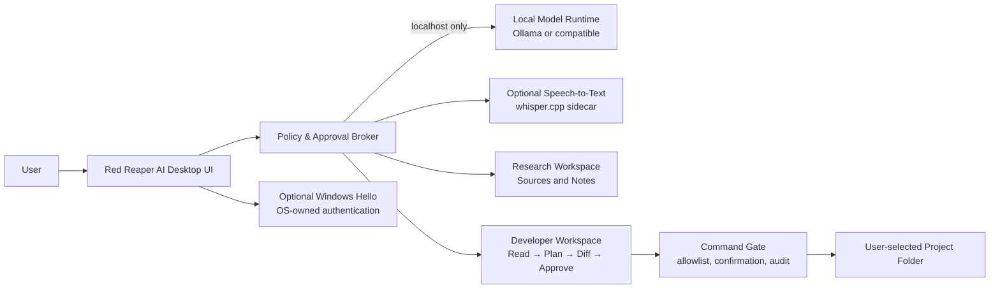

# Red Reaper AI: Local-First Desktop Assistant Foundation

**Status:** Foundation architecture
**Primary platform:** Windows 10 22H2+ and Windows 11
**Architecture decision:** A native desktop shell with a local model runtime, instead of a cloud-first chatbot or a remotely controlled agent.
**Scope:** Personal productivity, software engineering assistance, research with source attribution, and device-local voice interaction.

## Purpose

Red Reaper AI is a **local-first desktop assistant** designed to make a personal computer feel more capable without requiring a recurring AI subscription. Its first release concentrates on an elegant command center, locally served generative models, approved coding workflows, voice input, and inspectable execution history. It is a practical foundation rather than a claim of autonomous, universal expertise.

The system must never market itself as able to develop safely in every language, operate every IDE, or replace professional review. Instead, it gives the user a controlled workspace where a capable local model can propose plans, generate code, inspect a selected project, and execute only explicitly approved actions.

> **Cost boundary:** The application can use free and open-source components with no required paid API. Hardware, electricity, optional model downloads, and any third-party services the user elects to connect are outside that promise. Model licences must be shown and accepted per downloaded model; “open weights” and “open source” are not interchangeable.

## Product pillars

| Pillar | What the user receives | First-release boundary |
|---|---|---|
| **Command presence** | A cinematic, keyboard-first desktop command center with voice entry, command history, and clear live-state indicators. | Wake-word detection is not enabled by default; listening requires an explicit press-to-talk control or shortcut. |
| **Local intelligence** | A chooser for locally installed language models, conversations, code plans, and structured tool requests. | The assistant is useful only within the capability, context limit, and licence of the selected model. |
| **Developer copilot** | Project selection, repository reconnaissance, a plan-first coding workspace, diff preview, terminal approvals, and validation summaries. | No unattended source edits, package installation, credential access, or git push. |
| **Evidence-led research** | Notes, source links, search queries, extracted claims, and confidence labels. | No intrusion, credential collection, stalking, identity tracing, evasion, doxxing, or location tracking. |
| **Private control** | Local session data, a secrets boundary, configurable retention, and optional system authentication. | The application never receives or stores facial templates; Windows Hello remains the biometric authority. |

## Technical direction

A dedicated **Tauri v2 desktop application** is the recommended shell. It gives the user a real Windows application rather than a browser tab, while separating the WebView interface from narrowly exposed Rust commands. Tauri capabilities can constrain permissions by window or WebView, and the bundled interface alone has access by default. [1]

The desktop app talks to a **local-only agent service** that binds to loopback. The default model integration is Ollama, whose Windows application exposes its local API on `http://localhost:11434` after installation. Ollama supports native Windows execution and can use compatible NVIDIA or AMD GPU acceleration. [2] [3] This runtime is optional and replaceable: the user may point the assistant to a compatible local OpenAI-style endpoint instead.

For speech-to-text, the architecture supports a `whisper.cpp` sidecar. Its project documents a C/C++ implementation with CPU and several hardware-acceleration backends, including Windows builds and a voice-command example. [4] Text-to-speech is deliberately deferred until a local, licence-reviewed engine is selected. The initial application should work fully without microphone access.

## Trust model and action gates

The assistant should be treated as an untrusted planner with constrained local tools, not as a privileged operating-system administrator. Every action begins at the least-privilege level and is promoted only by a user confirmation in the visible application window.

| Operation | Default behavior | Elevation rule | Audit record |
|---|---|---|---|
| Ask a model a question | Allowed locally | None | Model identifier and local session ID; prompts are retained only if history is enabled. |
| Read a selected project | Allowed after choosing a folder | Folder-specific consent | File paths and a content-hash summary, not a hidden full-system scan. |
| Create or edit code | Draft only | Review plan and unified diff before apply | Requested files, diff, decision, and result. |
| Run a command | Blocked by default | Exact command, working directory, and effect shown before every run | Command, exit status, elapsed time, and user approval. |
| Install dependencies or modify toolchains | Blocked by default | Separate confirmation that names package, source, version, and expected effect | Installer command and package manifest diff. |
| Network access | Off by default | Per-request host and purpose confirmation | URL/domain, time, result summary. |
| Git commit, push, PR, release, or deployment | Blocked by default | Final explicit confirmation immediately before external effect | Target branch/remote and action outcome. |
| Open files containing secrets | Minimized | User must select the file; redaction view is default | Access event only; never log secret content. |

The code-assistant interaction must be **plan first**. An established open-source coding-agent workflow also recommends reviewing a plan before switching to build mode, and supports undoing edits; Red Reaper AI adopts this interaction model without embedding or automatically executing that specific product. [5]

## Windows Hello and facial recognition

Facial recognition must not be implemented as a custom webcam classifier or used to create a private biometric database. The desktop app may instead offer an **optional “Require Windows Hello to unlock privileged actions”** setting, using the operating system’s supported authentication experience. Windows Hello stores biometric identification data locally and does not transmit it to external devices or servers; compatible facial authentication relies on dedicated infrared hardware and anti-spoofing measures. [6]

The first implementation should protect only the desktop assistant’s local vault, settings, and high-impact action approvals. It should retain a PIN/fingerprint fallback through the Windows Hello flow and never lock the user out of their computer.

## Local model strategy

The installation wizard should inspect the machine, disclose available disk and memory, and show model choices by task category rather than promising a single “best brain.” It should not silently download multi-gigabyte files. Ollama’s Windows documentation notes that models can consume tens to hundreds of gigabytes and supports an `OLLAMA_MODELS` location override. [2]

| Task | Default approach | Selection principle |
|---|---|---|
| General assistant | Small-to-medium instruct model served locally | Prioritize response quality that fits the user’s RAM/VRAM. |
| Coding | Coding-specialized instruct model, with repository context constrained to the selected workspace | Show the model’s licence, size, context window, and capability warning before use. |
| Speech input | Local `whisper.cpp` model | Start with push-to-talk; provide a visible microphone meter and deletion control. |
| Embeddings and project search | Local embedding model with an on-disk index restricted to approved folders | Rebuild and erase index on demand. |
| Vision | Optional local vision model | Disabled until a clear local-image processing policy and resource budget exist. |

## Application components

| Component | Responsibility | Data boundary |
|---|---|---|
| **Desktop UI** | Command surface, model status, activity timeline, approvals, settings, and visual system. | Never executes arbitrary system commands directly. |
| **Policy broker** | Validates tool requests, enforces per-tool confirmations, limits paths and network hosts, and records actions. | Holds no biometric data and reads secrets only when the user specifically provides them through a secure flow. |
| **Model adapter** | Discovers local models, sends generation requests, streams responses, and reports health. | Loopback endpoints only by default; no silent cloud fallback. |
| **Voice adapter** | Handles explicit microphone capture and local transcription. | Audio is ephemeral by default and is never uploaded. |
| **Code workspace** | Builds project map, prepares plans/diffs, offers unit-test commands, and stores session artefacts locally. | Operates only in user-selected directories. |
| **Research workspace** | Stores sources, quotations, notes, and claim links. | Uses a visible request log; no hidden collection of personal or sensitive data. |
| **Encrypted local vault** | Stores non-biometric preferences and optional third-party credentials. | Uses platform-provided secure storage; credentials are never included in prompts or logs. |

## Packaging and installation

The initial installer is intentionally split into transparent steps: install Red Reaper AI, optionally install/locate a local runtime, select a model directory, choose a model after reviewing its licence and size, then complete a first-run hardware check. This is more trustworthy than a single opaque installer that bundles undocumented executables.

Tauri supports bundling explicitly declared external sidecar binaries, but its documentation requires sidecar execution permissions and allows command arguments to be constrained. [7] Red Reaper AI must use this capability for only a short allowlist of shipped sidecars such as a signed voice transcriber. It must never use a generic shell capability to turn model output into arbitrary commands.

## Explicit exclusions

The foundation does **not** include exploit execution, password recovery against third parties, network scanning of systems without authorization, bypassing security controls, surveillance, identity tracing, location discovery, stealth/evasion features, “jailbreaking,” VPN chaining, or Tor-browser modification. Those functions are unsafe, legally sensitive, and unrelated to a trustworthy personal assistant.

The research component may support legitimate documentation search, source analysis, programming help, privacy explanations, and defensive local security checklists. It will be designed to keep decision-making, approval, and accountability with the user.

## Delivery milestones

| Milestone | Deliverable | Acceptance evidence |
|---|---|---|
| **M1: Command center** | A polished desktop UI with command entry, model/runtime cards, approval timeline, and first-run state. | App builds, starts, and navigates without external keys. |
| **M2: Local runtime** | Loopback-only Ollama health check, model chooser, streamed local chat, explicit model-size/licence disclosure. | A local model response is displayed and runtime failure is explained without cloud fallback. |
| **M3: Voice** | Push-to-talk transcription adapter with an off-by-default microphone permission flow. | Test transcription is visible; deleting a session removes stored transcript data. |
| **M4: Code workspace** | Folder picker, repository map, plan/diff review, safe command preview, and audit log. | A sample project can be inspected and a diff requires explicit approval before applying. |
| **M5: Security hardening** | Optional Windows Hello re-authentication, vault, test coverage, signed installer, and recovery documentation. | Privileged actions prompt correctly and no biometric payload is processed by the app. |

## References

[1]: https://v2.tauri.app/security/capabilities/ "Tauri v2 — Capabilities"
[2]: https://docs.ollama.com/windows "Ollama — Windows"
[3]: https://docs.ollama.com/api/introduction "Ollama — API introduction"
[4]: https://github.com/ggml-org/whisper.cpp "whisper.cpp — high-performance speech recognition"
[5]: https://opencode.ai/docs/ "OpenCode — documentation"
[6]: https://learn.microsoft.com/en-us/windows/security/identity-protection/hello-for-business/ "Microsoft Learn — Windows Hello for Business"
[7]: https://v2.tauri.app/develop/sidecar/ "Tauri v2 — Embedding external binaries"
